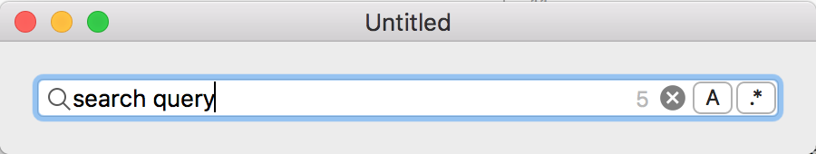

# Search Field with Inline Buttons

This is a proof-of-concept implementation of a `NSSearchField` with inline buttons:

Buttons can be dynamically added to the search field and could be used to set search options such as regular expressions or case sensitivity. 

__This prototype is inspired from the work I did on implementing multiple search fields for [xi-mac](https://github.com/google/xi-mac).__
